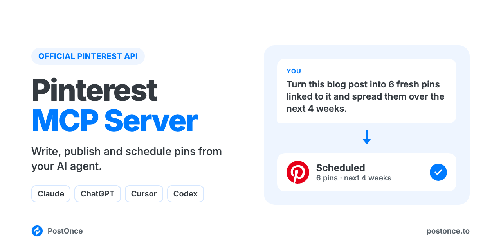

<p align="center"></p>

# Pinterest MCP Server

Pinterest MCP server for Claude, ChatGPT, Cursor and Codex. Your AI agent can write, publish and schedule Pinterest pins, carousels and video pins, with a title, description, board and destination link, through Pinterest's official API. There's no scraping, no browser automation and no Pinterest developer app to set up.

It runs on [PostOnce](https://postonce.to)'s hosted MCP server and comes with Pinterest skills, so your agent writes keyword-led pins, makes 1000×1500 pin images and turns one blog post into a month of fresh pins.

```
You:    Make pins for my sourdough starter guide and spread them over the next
        four weeks. Link them to the article.
Claude: Used the pinterest-blog-to-pins skill. Here are 6 pins, each with its own
        image, title and description, all linking to the guide. Scheduled on
        PostOnce for Mon and Thu at 8:00 PM on your "Sourdough Baking" board.
```

## What you can do

| Ask your agent to | How it works |
| --- | --- |
| Publish an image pin now | `create_upload_url`, upload, then `create_post` with `media` |
| Schedule a pin for later | `create_post` with `publish_at` |
| Post a carousel (up to 5 images) or a video pin (4 seconds to 5 minutes) | Pass the images in order, or one video, as `media` |
| Set the pin title, description and destination link | `title` and `link` in `platform_options`; the post text becomes the description (up to 500 characters) |
| Pick the board | `boardId` in `platform_options`. Without it, the pin goes to the account's default board, or a board named "PostOnce" that's created for you |
| Save a draft to finish later | `create_draft` |
| Check whether a pin went out, and get its URL | `get_post` |
| Change or cancel a scheduled pin | `update_post`, `cancel_post` |
| Post the same thing to Pinterest and other platforms | Add more targets to `create_post` (Instagram, TikTok, YouTube, LinkedIn, X, Threads, Facebook, Bluesky) |

Every pin needs an image or a video; text-only pins aren't possible. Not supported: alt text, Idea Pins, board sections, creating or renaming boards, analytics, comments, and editing or deleting pins that are already live. This server publishes; it doesn't browse Pinterest for you.

## Setup (about a minute)

You need a [PostOnce account](https://postonce.to) (free for 7 days, no card) with your Pinterest account connected.

**Claude (claude.ai and desktop) and ChatGPT:** add a custom connector with the URL below and sign in with PostOnce. No API key.

```
https://postonce.to/mcp
```

Step-by-step: [Claude](https://postonce.to/integrations/claude) · [ChatGPT](https://postonce.to/integrations/chatgpt)

**Claude Code, Codex and Cursor:** install this repo as a plugin. It adds the MCP connection and the skills below together. Create an API key in [PostOnce preferences](https://postonce.to/dashboard/preferences) and give it to your client as the `POSTONCE_API_KEY` environment variable. Never paste the key into chat.

```bash
# Claude Code
claude plugin marketplace add postoncehq/plugins
claude plugin install pinterest-mcp@postoncehq
```

Step-by-step: [Claude Code](https://postonce.to/integrations/claude-code) · [Codex](https://postonce.to/integrations/codex) · [Cursor](https://postonce.to/integrations/cursor)

**Any other MCP client:** point it at `https://postonce.to/mcp` (Streamable HTTP) with the header `Authorization: Bearer <your PostOnce API key>`.

## Skills included

| Skill | What it does |
| --- | --- |
| [`pinterest-pin-description-generator`](skills/pinterest-pin-description-generator/SKILL.md) | Writes keyword-led pin titles (up to 100 characters) and descriptions (up to 500) that match what people search on Pinterest. |
| [`pinterest-seo-keywords`](skills/pinterest-seo-keywords/SKILL.md) | Builds a keyword set for your niche and maps it to boards, titles and descriptions. |
| [`pinterest-board-ideas`](skills/pinterest-board-ideas/SKILL.md) | Suggests searchable board names and descriptions for your niche. You create the boards in Pinterest. |
| [`pinterest-pin-maker`](skills/pinterest-pin-maker/SKILL.md) | Designs 1000×1500 (2:3) pin images with a readable text overlay, rendered from HTML to PNG. |
| [`pinterest-blog-to-pins`](skills/pinterest-blog-to-pins/SKILL.md) | Turns one blog post URL into 5–10 fresh pins with different images and titles, scheduled over several weeks and linked to the post. |
| [`pinterest-content-calendar`](skills/pinterest-content-calendar/SKILL.md) | Plans 1–4 weeks of pins from your goals or a source, drafts each one and schedules them on approval. |
| [`postonce`](skills/postonce/SKILL.md) | Publishing workflow: pick the right account, upload media, schedule, and confirm the pin actually went live. |

## FAQ

**Does Pinterest have an official MCP server?**
This server uses Pinterest's official API through PostOnce. Your agent publishes through the permissions you grant when you connect, not through a browser or a scraped endpoint.

**Can Claude post to Pinterest?**
Yes, once it's connected to an MCP server that can publish, like this one. Claude writes the pin, uploads the image and calls `create_post`.

**Is it safe for my Pinterest account?**
Yes. Pins go through Pinterest's official API with the permissions you grant when you connect. Many Pinterest MCP servers on GitHub drive a logged-in browser session or an unofficial, scraped API instead, which Pinterest's terms don't allow and which can get accounts restricted.

**Can it choose the Pinterest board?**
Yes. Pass the board's ID as `boardId`. If you don't, the pin goes to the account's default board, and if there isn't one, PostOnce creates a board named "PostOnce". The server can't create or rename boards for you, and it doesn't list your boards, so keep your board IDs handy or move pins in Pinterest afterward.

**Can it add a link to my pins?**
Yes. Set `link` in `platform_options` to any http or https URL. The link is optional.

**Do I need a Pinterest developer app or API approval?**
No. PostOnce holds the Pinterest API access; you just connect your account.

**Is it free?**
The skills and this repo are free and MIT-licensed. Publishing runs through a PostOnce account, which you can try free for 7 days without entering a card. After that, see [pricing](https://postonce.to/pricing).

## Other platforms

The same connection posts everywhere PostOnce supports. Platform repos with their own skills:
[LinkedIn MCP](https://github.com/postoncehq/linkedin-mcp) · [Instagram MCP](https://github.com/postoncehq/instagram-mcp) · [TikTok MCP](https://github.com/postoncehq/tiktok-mcp) · [YouTube MCP](https://github.com/postoncehq/youtube-mcp) · [Facebook MCP](https://github.com/postoncehq/facebook-mcp) · [X (Twitter) MCP](https://github.com/postoncehq/x-mcp) · [Threads MCP](https://github.com/postoncehq/threads-mcp) · [Bluesky MCP](https://github.com/postoncehq/bluesky-mcp)

## License

MIT. See [LICENSE](LICENSE).
